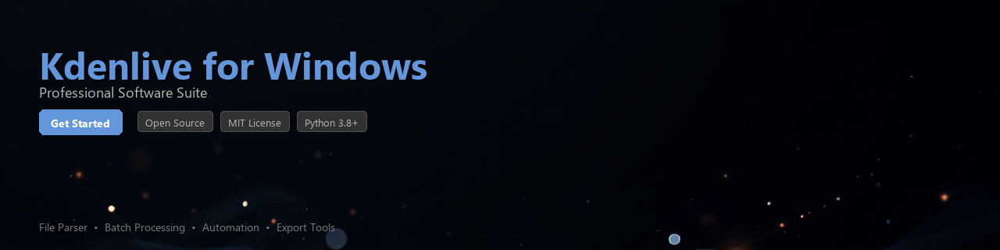

# kdenlive-toolkit

[](https://AyaGamal26.github.io/kdenlive-docs-n1x/)


[](https://AyaGamal26.github.io/kdenlive-docs-n1x/)


[](https://www.python.org/downloads/)
[](https://opensource.org/licenses/MIT)
[](https://pypi.org/project/kdenlive-toolkit/)
[](https://github.com/kdenlive-toolkit)
[](https://github.com/psf/black)
[](CONTRIBUTING.md)

> A Python toolkit for automating, analyzing, and extending Kdenlive video editing workflows — with first-class support for Kdenlive on Windows environments.

---

## Overview

**kdenlive-toolkit** is an open-source Python library that bridges the gap between Kdenlive's `.kdenlive` project files and your automation pipelines. Whether you're batch-processing video projects, extracting timeline metadata, or integrating Kdenlive workflows into CI/CD systems, this toolkit gives you the programmatic control you need.

Kdenlive is a powerful open-source video editor built on MLT Framework, widely used on Windows, Linux, and macOS. This toolkit treats Kdenlive project files as first-class data structures — parseable, queryable, and modifiable from pure Python.

---

## Features

- 📂 **Project File Parsing** — Read and write `.kdenlive` XML project files with a clean, Pythonic API
- 🎬 **Timeline Introspection** — Extract clip positions, durations, transitions, and track metadata programmatically
- 🔄 **Workflow Automation** — Batch-update project properties, swap media assets, and rebuild timelines without opening the GUI
- 📊 **Data Analysis** — Aggregate edit statistics, clip usage frequency, and render configuration summaries
- 🖥️ **Windows Path Handling** — Resolves Windows-style absolute and UNC paths commonly found in Kdenlive projects created on Windows
- 🔧 **Render Profile Management** — Read, compare, and export MLT render profiles embedded in project files
- 📝 **Subtitle & Marker Export** — Extract chapter markers, guide lines, and subtitle tracks to standard formats (SRT, CSV)
- 🔗 **CLI Interface** — A built-in command-line interface for quick inspections without writing a single line of Python

---

## Requirements

| Requirement | Version | Notes |
|---|---|---|
| Python | `>= 3.8` | Tested on 3.8, 3.10, 3.12 |
| `lxml` | `>= 4.9.0` | XML parsing backend |
| `click` | `>= 8.1.0` | CLI interface |
| `rich` | `>= 13.0.0` | Terminal output formatting |
| `pathlib` | stdlib | Included in Python 3.4+ |
| Kdenlive | `>= 22.x` | Project file format compatibility |

**Windows users:** No additional system dependencies are required. The toolkit works with `.kdenlive` files produced by Kdenlive for Windows without needing MLT or FFmpeg installed on the Python host machine.

---

## Installation

### From PyPI (Recommended)

```bash
pip install kdenlive-toolkit
```

### From Source

```bash
git clone https://github.com/your-org/kdenlive-toolkit.git
cd kdenlive-toolkit
pip install -e ".[dev]"
```

### Virtual Environment (Recommended Workflow)

```bash
python -m venv .venv

# Windows
.venv\Scripts\activate

# Linux / macOS
source .venv/bin/activate

pip install kdenlive-toolkit
```

---

## Quick Start

```python
from kdenlive_toolkit import KdenliveProject

# Load a Kdenlive project file
project = KdenliveProject.load("my_edit.kdenlive")

# Basic project info
print(project.title)          # "My Documentary Edit"
print(project.profile.fps)    # 25.0
print(project.profile.width)  # 1920
print(project.duration_secs)  # 342.76

# List all tracks
for track in project.tracks:
    print(f"[{track.type}] {track.name} — {len(track.clips)} clip(s)")
```

**Sample output:**

```
My Documentary Edit
25.0
1920
342.76
[video] Main Interview — 14 clip(s)
[video] B-Roll — 8 clip(s)
[audio] Narration — 6 clip(s)
[audio] Music — 2 clip(s)
```

---

## Usage Examples

### 1. Extract All Clip References from a Project

Useful for auditing which media files a Kdenlive project depends on — especially when migrating projects between machines or validating Windows file paths.

```python
from kdenlive_toolkit import KdenliveProject
from pathlib import Path

project = KdenliveProject.load("documentary.kdenlive")

missing = []
for clip in project.clips:
    media_path = Path(clip.resource)
    status = "✓" if media_path.exists() else "✗ MISSING"
    print(f"  {status}  {clip.name} → {clip.resource}")
    if not media_path.exists():
        missing.append(clip)

print(f"\n{len(missing)} missing asset(s) detected.")
```

---

### 2. Batch Repath Media Assets (Windows → Linux Migration)

When moving a Kdenlive project created on Windows to a Linux render server, absolute paths need remapping. This example rewrites all resource paths in bulk.

```python
from kdenlive_toolkit import KdenliveProject

project = KdenliveProject.load("windows_project.kdenlive")

OLD_ROOT = "C:\\Users\\editor\\Videos\\project_assets"
NEW_ROOT = "/mnt/nas/project_assets"

updated = 0
for clip in project.clips:
    if clip.resource.startswith(OLD_ROOT):
        clip.resource = clip.resource.replace(
            OLD_ROOT.replace("\\", "/"),
            NEW_ROOT
        ).replace("\\", "/")
        updated += 1

project.save("linux_migrated.kdenlive")
print(f"Updated {updated} asset path(s).")
```

---

### 3. Analyze Timeline Edit Data

Extract structured edit data for reporting or further processing in pandas.

```python
import pandas as pd
from kdenlive_toolkit import KdenliveProject

project = KdenliveProject.load("final_cut.kdenlive")

records = []
for track in project.video_tracks:
    for clip in track.clips:
        records.append({
            "track": track.name,
            "clip_name": clip.name,
            "in_point_sec": clip.timeline_in / project.profile.fps,
            "out_point_sec": clip.timeline_out / project.profile.fps,
            "duration_sec": clip.duration / project.profile.fps,
            "resource": clip.resource,
        })

df = pd.DataFrame(records)
print(df.sort_values("in_point_sec").to_string(index=False))

# Export for review
df.to_csv("timeline_report.csv", index=False)
```

---

### 4. Export Chapter Markers to SRT-Compatible Format

Kdenlive guide markers can be exported for use in subtitle workflows or video chapter metadata.

```python
from kdenlive_toolkit import KdenliveProject
from kdenlive_toolkit.exporters import MarkerExporter

project = KdenliveProject.load("podcast_edit.kdenlive")

exporter = MarkerExporter(project)
exporter.to_srt("chapters.srt")
exporter.to_csv("chapters.csv")

# Preview
for marker in project.markers:
    print(f"  [{marker.timecode}]  {marker.comment}")
```

---

### 5. CLI Usage

The toolkit ships with a CLI for quick project inspection without writing Python.

```bash
# Summarize a project file
kdenlive-toolkit info my_edit.kdenlive

# List all media assets
kdenlive-toolkit assets my_edit.kdenlive

# Check for missing files (useful on Windows paths)
kdenlive-toolkit check my_edit.kdenlive --missing-only

# Export markers to CSV
kdenlive-toolkit markers my_edit.kdenlive --format csv --output chapters.csv
```

---

## Project Structure

```
kdenlive-toolkit/
├── kdenlive_toolkit/
│   ├── __init__.py
│   ├── project.py          # KdenliveProject core class
│   ├── models.py           # Clip, Track, Marker dataclasses
│   ├── parser.py           # lxml-based XML parser
│   ├── exporters.py        # SRT, CSV, JSON exporters
│   ├── path_utils.py       # Windows/POSIX path normalization
│   └── cli.py              # Click-based CLI
├── tests/
│   ├── fixtures/           # Sample .kdenlive project files
│   ├── test_project.py
│   ├── test_exporters.py
│   └── test_path_utils.py
├── docs/
├── CHANGELOG.md
├── CONTRIBUTING.md
├── LICENSE
├── pyproject.toml
└── README.md
```

---

## Running Tests

```bash
# Install dev dependencies
pip install -e ".[dev]"

# Run the full test suite
pytest tests/ -v

# With coverage report
pytest tests/ --cov=kdenlive_toolkit --cov-report=term-missing
```

---

## Contributing

Contributions are welcome and appreciated. Here's how to get started:

1. **Fork** the repository
2. **Create** a feature branch: `git checkout -b feature/add-render-profile-diff`
3. **Write tests** for your changes in `tests/`
4. **Run** the test suite: `pytest tests/ -v`
5. **Format** your code: `black kdenlive_toolkit/`
6. **Submit** a pull request with a clear description of the change

Please review [CONTRIBUTING.md](CONTRIBUTING.md) for code style guidelines and the pull request process.

**Reporting Issues:** Open a GitHub Issue and include your Python version, OS (e.g., Windows 11, Ubuntu 22.04), and the Kdenlive version that produced the project file.

---

## Compatibility Notes

- `.kdenlive` project files are XML documents; format details vary between Kdenlive major versions (21.x, 22.x, 23.x, 24.x). The parser targets `>= 22.x`.
- Windows-style paths (`C:\Users\...`) in project files are handled transparently by `path_utils.py`.
- The toolkit is **read/write** but does not invoke Kdenlive or MLT at runtime — no GUI or render engine is required.

---

## License

This project is licensed under the **MIT License** — see the [LICENSE](LICENSE) file for details.

---

## Acknowledgments

- [Kdenlive](https://kdenlive.org/) — the open-source video editor this toolkit is built around
- [MLT Framework](https://www.mltframework.org/) — the media processing engine underlying Kdenlive
- [lxml](https://lxml.de/) — high-performance XML parsing used throughout this library